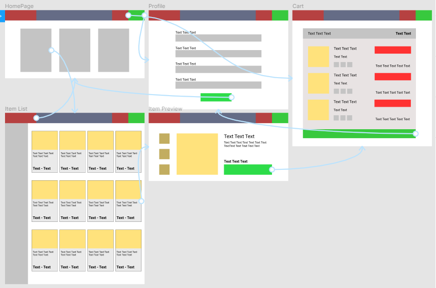

# HardwareWebstore
Grupo de WebDev

## Project Report

**Group: 13**

| **Authors** | **nUSP** |
| --- | --- |
| Luiz Gustavo Sincaruk Vieira | 10374622 |
| Maurílio da Motta Meireles | 10734501 |
| Vitor Kodhi Teruya | 10284441 |

**Diagram**

**Medium-High Fidelity Mockup:**

[Mockups](https://www.figma.com/proto/Fwt6kR6XM6HhqzZK6LvhAx/Medium-High-Fidelity-Mockup?node-id=6%3A2&scaling=min-zoom&page-id=0%3A1)

**Requirements:**

- There will be 2 types of users, Clients and Administrators.
- Admin record will include name, ID, phone number and email address.
- Each customer will need to fill a form that includes name, ID, address, phone
    number and email addresss.
- Products will include name, ID, photo, description, price, quantity in stock and
    quantity sold.
- Products are selected, their quantity chosen and are included in a shopping
    cart. Products are purchased using a credit card number.
- Carts are emptied only on payment or by customers.
- Administrators can create/read/update/delete new products.
- We will have a purchase history for the customer. So they can see what they
    bought in our store.

**Project Description:**

We will implement a Hardware Store. We will implementsome functionalities:

- Administrator’s form
- Customer 's form
- Purchase history for the customer
- Create/read/update/delete new products
- Shopping Cart

Removed Categories feature

**Comments About the Code:**

We used localStorage in order to manage front end information such as the cart and user information.
Some comments in code are about features we were to implement but decided not to use them.

**Test Plan:**

We tested our backend using Insomnia Software, so we could better visualize information and test them faster \(we think it can also be done in Postman\)

**Test Results:**

We tested and foud out OK:
Product CRUD
User CRUD

Orders weren't implemented in frontend but it's Create, Read and Delete functions are OK

Our authentication process works but isn't safe for production pursposes

**Build Procedures:**

Front-end:

    cd webapp
    npm install
    npm run start

\(Our server does nothing at the moment\)
Back-end:

    cd server
    npm install
    npm run dev (or node src/server.js)

**Problems:**

In front-end not all features are covered , we are missing: admin page to manage store products and listing purchase history for costumers

**Comments:**

Overall our backend has the functionality needed by the application. Our code is not safe for production purposes \(Not using jwt and sending plain text information to server including password\)